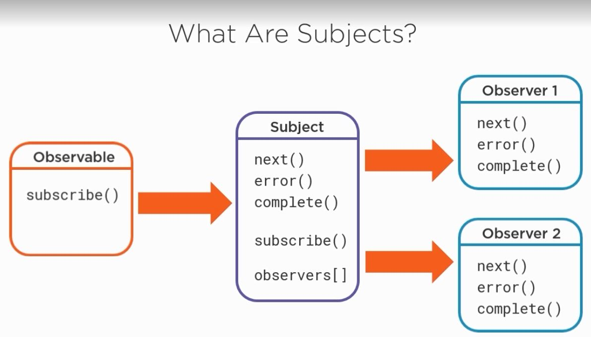
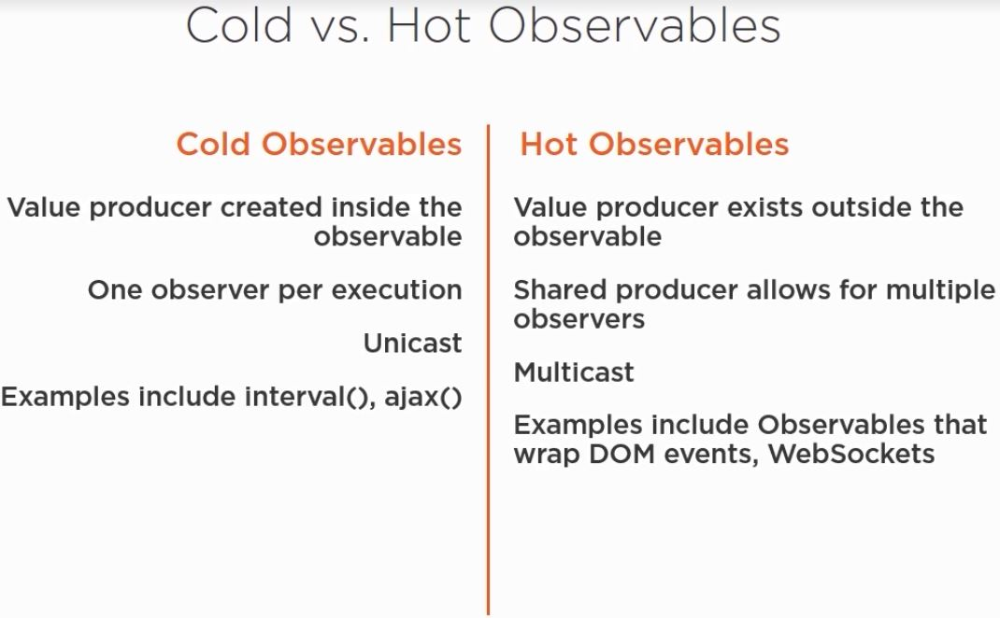

# RxBookTracker

## RxJS

RxJS is a library for building asynchronous applications with observable sequences.

## RxJS Building Blocks

1.  Observables
1.  Observers
    -   Observers implements observer interface which have three methods which correspond on function callback
        1.  next:
        1.  error:
        1.  complete:
1.  Subscriptions
1.  Operators
    - Categories of Operators
        1. Transformation
        1. Filtering
        1. Combination
        1. Utility
        1. Conditional
        1. Aggregate
        1. Muticasting
1.  Subjects
    - What are subjects?
        1. Observables
        1. Observers
        1. Produce values
        1. Proxy values
        1. Have state and maintain a list of observers
        1. Muticast instead of unicast

    
    

    - Specialized Subjects
        1. AsyncSubject
            - Only emits the last value received
            - Used by the publishLast() operator
        1. BehaviorSubject
            - Emits initial seed value if source has not yet produced a value
            - Emits most recent value otherwise
            - Used by publishBehavior() operator
        1. ReplaySubject
            - Stores and emits multiple values to all observers
            - used by publishReplay() operator
1.  Schedulers
    - Available schedulers in RxJS
        1. queueScheduler (Sync Task Queue - main queue)
        1. asyncScheduler (Async Task Queue - high priority)
        1. asapScheduler (Async Microtask Queue - higher priority)
        1. animationFrameScheduler
        1. TestScheduler
